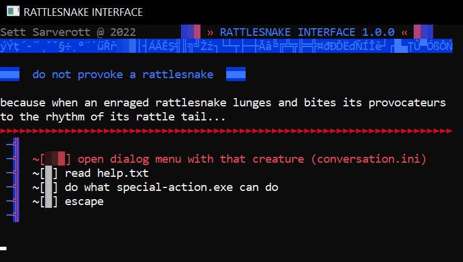

# ascii-rattlesnake

simple windows cmd interface to make faster various admin tasks

### keymap:
 -  __w/arrow up__ - go up
 -  __s/arrow down__ - go down
 -  __e/enter/space__ - select
 -  __x/esc__ - back

### commandline:
   rattlesnake.exe [override-config.ini [setup-project-name version author]]

### FILE SYNTAX
  every ini file is separed menu, primary default is config.ini
  set menu title to "main":
  ```
    title=main
  ```
  set description to "hello":
  ```
    description=hello
  ```
  create new option button with type "action":
  ```
    #action
  ```
  available options: action, text, submenu, exit
  create action that executes ipconfig
  ```
    #action
    label=show net interfaces
    command=ipconfig
  ```
  option that prints file.txt
  ```
    #text
    label=file.txt
    textfile=.\file.txt
  ```
  option that opens submenu from file .\setup\controllpanel\admin.ini
  ```
    #submenu
    label=admin workshop
    submenupath=.\setup\controllpanel\admin.ini
  ```
  option that runs batchfile
  ```
    #action
    label=run script
    command=start \b script.bat
  ```


##### CREATED FOR WSTI by Sett Sarverott @ 2022


### todo:
  - users system
  - encryption of internal files
  - remote access (standard server-client or reverse shell client-server)
  - self-updating
